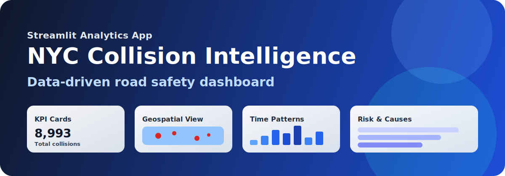
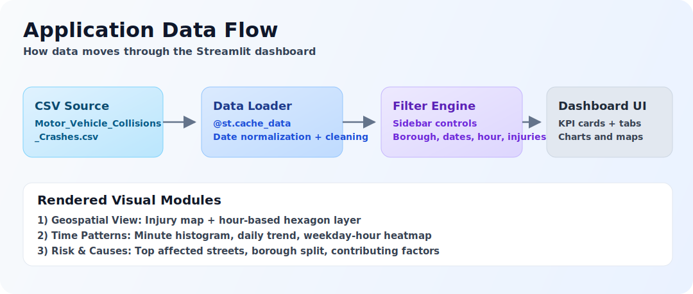
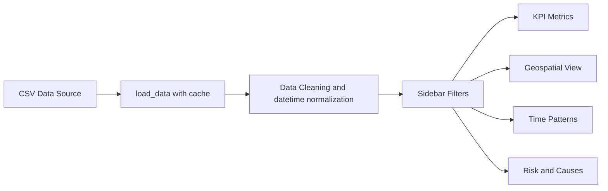

# NYC Collision Intelligence Dashboard



A professional Streamlit dashboard for exploring motor vehicle collision patterns in New York City using a large public CSV dataset.

## What This App Does

This app loads NYC collision records, cleans and normalizes the data, and provides an interactive analysis interface for business users and customers.

### Core capabilities

- Reads collision data from `Motor_Vehicle_Collisions_-_Crashes.csv`.
- Parses and normalizes crash date/time for time-based analytics.
- Applies interactive filtering by:
  - Borough
  - Date range
  - Hour of day
  - Minimum injured persons
- Shows high-level KPIs:
  - Total collisions
  - People injured
  - People killed
  - Average collisions per day
- Organizes visual analysis into three tabs:
  - Geospatial View
  - Time Patterns
  - Risk & Causes

## Visual Analytics Included

### 1) Geospatial View

- Injury hotspot map for records above selected injury threshold.
- Hour-specific collision intensity map using a hexagon layer.

### 2) Time Patterns

- Minute-level collision bar chart for selected hour.
- Daily collision trend line chart.
- Weekday x hour collision intensity heatmap.

### 3) Risk & Causes

- Top 5 dangerous streets by affected class:
  - Pedestrians
  - Cyclists
  - Motorists
- Collisions by borough chart.
- Top 10 contributing factors chart.

## Project Graphics

### Dashboard concept graphic


### Data flow graphic



## Architecture Overview



## Tech Stack

- Python
- Streamlit
- Pandas
- NumPy
- PyDeck
- Plotly Express

## How to Run Locally

### 1) Create and activate virtual environment

macOS/Linux:

```bash
python3 -m venv venv
source venv/bin/activate
```

Windows PowerShell:

```powershell
python -m venv venv
venv\Scripts\Activate.ps1
```

### 2) Install dependencies

```bash
pip install -r requirements.txt
```

### 3) Download dataset

Download the lat_long.csv and Motor_Vehicle_Collisions_-_Crashes.csv data from this google drive folder.
https://drive.google.com/drive/folders/11n_QsW0LyjQi9prNYqGI12AoweFEhAkT?usp=sharing

### 4) Start the app

```bash
streamlit run app.py
```

## Suggested Project Structure

```text
nyc-webapp/
├── app.py
├── requirements.txt
├── Motor_Vehicle_Collisions_-_Crashes.csv
├── assets/
│   ├── dashboard-hero.svg
│   └── data-flow.svg
└── README.md
```

## Notes for Customer Demos

- Use sidebar filters to quickly tailor analysis to customer questions.
- Start with KPI cards, then walk through each tab for narrative flow.
- Focus on the Top 10 contributing factors chart to discuss road-safety interventions.

## Future Enhancements

- Add downloadable PDF summary report.
- Add logo/brand theme switch for customer-specific presentations.
- Add anomaly detection and forecast trend modules.
